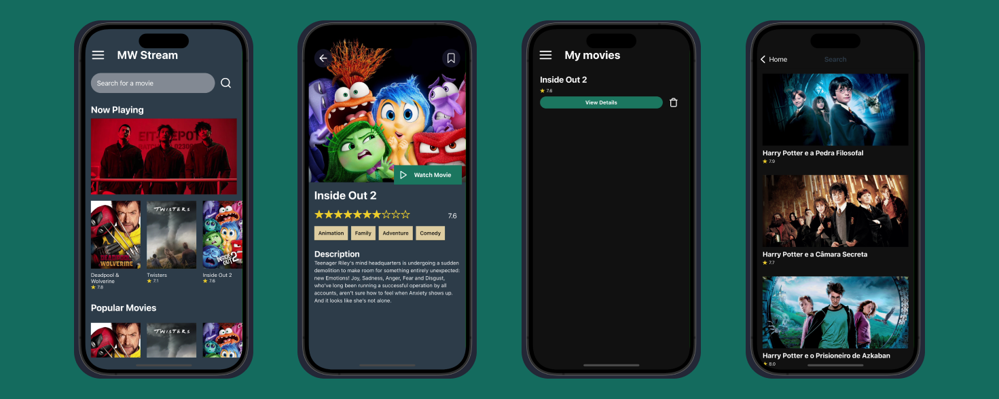

# MW-STREAM

## Introduction

This document serves as a guide for the structure, development, and maintenance of the MW-STREAM project, a React Native application.

## Objective

The primary objective of MW-STREAM is to list and search for movies and series with details and an option to save them to favorites.

## Technologies Used

- **React Native**
- **Expo**
- **Typescript**
- **Axios**
- **Reanimated**
- **AsyncStorage**
- **React Native Testing Library**

## Folder Structure

The project structure is organized as follows:

- **android** and **ios**: Contain platform-specific projects generated by React Native.

- **assets**: Stores static files such as images, icons, fonts, etc.

- **node_modules**: Contains the project dependencies installed via npm or yarn.

- **src**:

  - **components**: Contains reusable components such as buttons, inputs, cards, etc.

    - **tests**: Contains unit tests.

  - **i18n**: Contains translation configuration files.

  - **pages**: Contains the main screens of the application.

  - **routes**: Defines navigation between screens.

  - **services**: Contains the logic for API requests.

  - **utils**: Various utility functions.

  - **types**: Global typings.

- **.gitignore**: Defines the files that should not be versioned.

- **app.json**: General application settings.

- **babel.config.js**: Babel configuration for JavaScript transpilation.

- **package.json**: Lists the project dependencies.

## Installation and Execution

### Prerequisites

- Node.js and npm (or yarn) installed.

- Development environment for Android (Android Studio) or iOS (Xcode).

### Cloning the Repository

```bash
git clone https://github.com/euvini/mwstream.git
```

### Instalação

```bash
$ yarn
or
$ npm i
```

### Set Up Environment Variables

Create a new file named `.env` in the root of your project and add the following content:

```bash
	API_KEY=***********
```

### Build

```bash
iOS: cd ios & pod install
Build iOS: yarn ios or npm run ios

Build Android: yarn android or npm run android
```

### Screenshots


